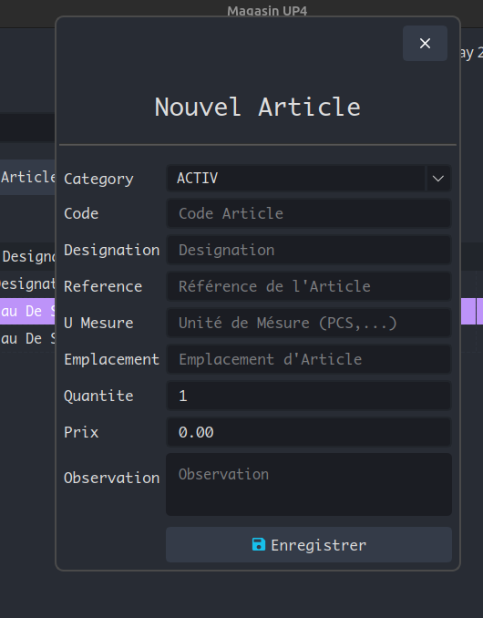
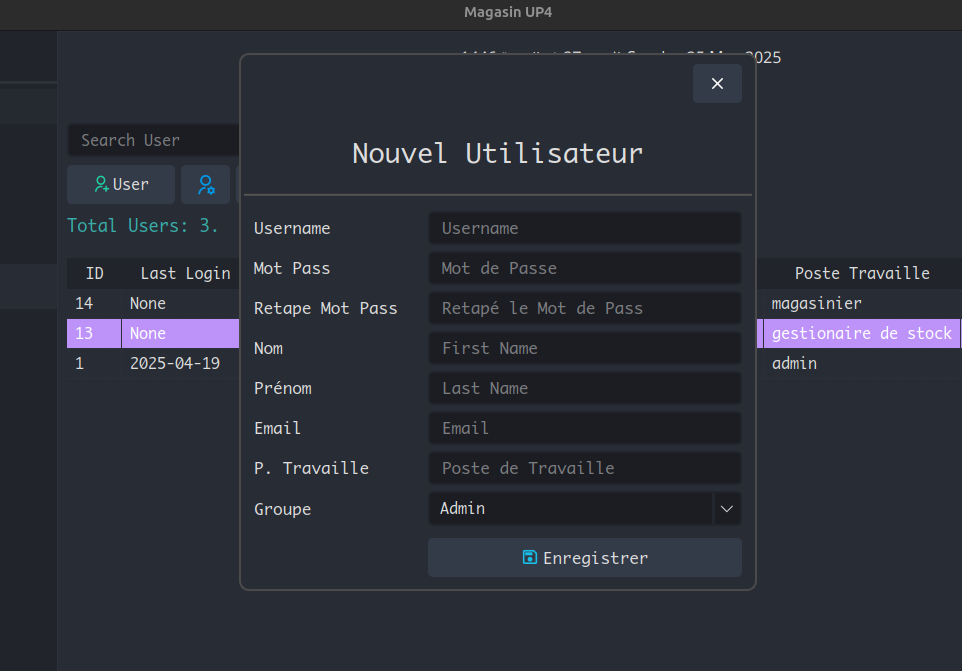

# PyQt5 Inventory Management System

This is a desktop inventory management application built with **PyQt5** and **SQLite3**, designed for both **admins** and **regular users**. It includes user authentication (with Django-style password hashing), stock movement tracking (entries, exits), article and category management, and user profile handling.

---

## 🔧 Features

- ✅ Login system with hashed passwords (Django PBKDF2)
- 🔐 Role-based access (admin and regular user views)
- 📦 Article CRUD (create, update, delete)
- 🔄 Stock movement logging (entrée/sortie)
- 📅 Movement search by date and filters
- 🧑‍💼 User management (add, edit users with profiles)
- 🎨 Custom UI with dark mode stylesheets
- 🗂️ QStackedWidget-based navigation
- 📋 QTableWidget with sorting and filtering
- 🔍 Custom dialogs for search and creation
- 🧵 Transaction-safe database operations

---

## 🗃️ Database Schema

Two main tables:

### `auth_user`
- `id`, `username`, `email`, `password` (hashed)
- `first_name`, `last_name`
- `is_superuser`, `is_staff`, `is_active`
- `date_joined`

### `accounts_profile`
- `id`, `user_id` (FK to `auth_user`)
- `poste_travaille`, `groupe` (e.g. "admin", "other")

Other tables include:
- `article`
- `movement`
- `category`

---

## 🚀 Getting Started

### Requirements

- Python 3.8+
- PyQt5
- passlib
- ummalqura for hijri calendar
- qtawesome for icons

```bash
pip install PyQt5 passlib ummalqura qtawesome rich
```

### Run the Application

```bash
python main.py
```

### 🧪 Development Notes

- Passwords are stored using passlib.hash.django_pbkdf2_sha256.
- Database operations are wrapped in transaction.atomic() style or conn.begin()/commit()/rollback() for integrity.
- Admin buttons (e.g., "Edit User") are hidden for non-admins using role checks.
- UI is designed using Qt Designer and loaded with .ui files or built manually.

### 🔐 Login Flow

- Login form checks username and password using Django's PBKDF2 hasher.
- On success, user info is returned and MainWindow is shown.
- Admin-only panels are shown/hidden based on is_superuser.

### 🧑💻 Author

- Haj Ibrahim – Python Developer, Inventory Solutions Enthusiast bdabve@gmail.com

### 📄 License

This project is licensed under the MIT License.

---

Let me know if you'd like to generate this as a file or adjust it for a `.docx` or PDF version or .exe file.


## 🖼️ Screenshots

<!--### 🔐 Login Screen-->
<!---->

### 🧾 Main Dashboard


### 📦 Article Management


### 📦 New Article


### 🧑 User Management


### 🧑 New User


### 🔍 Movement Search

